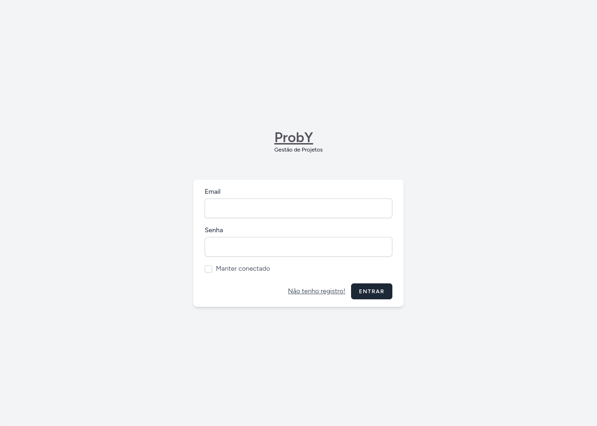
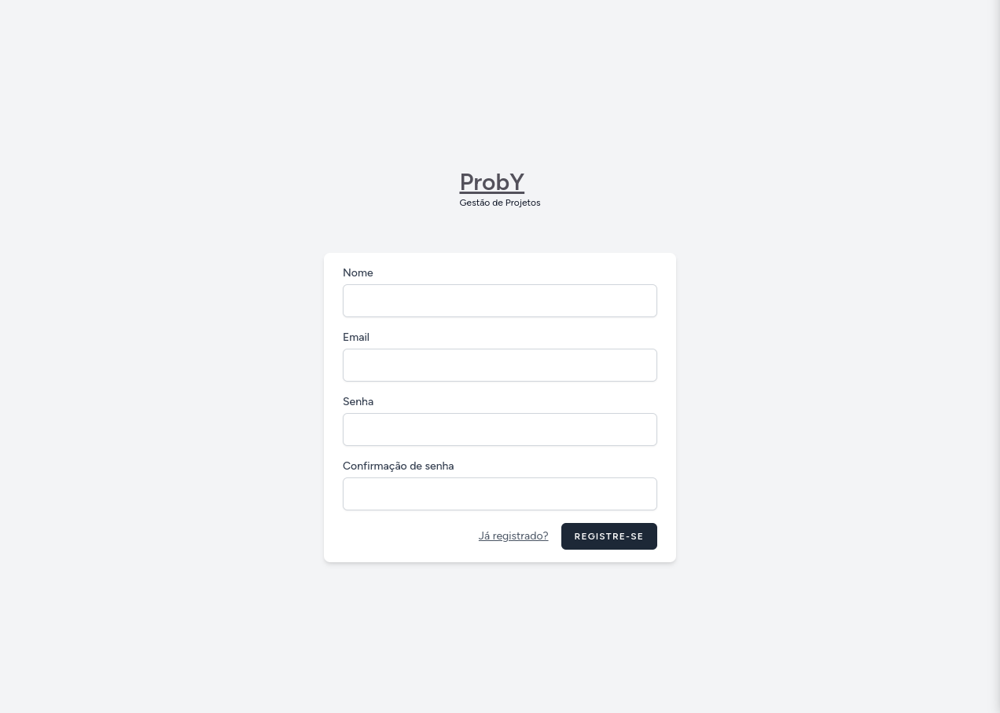
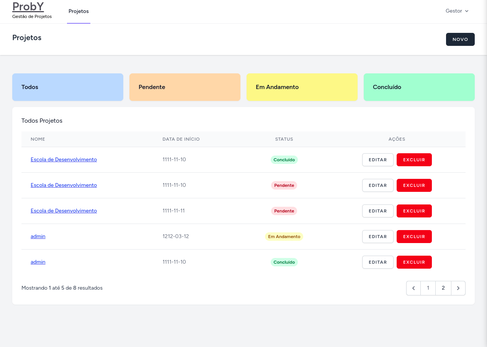
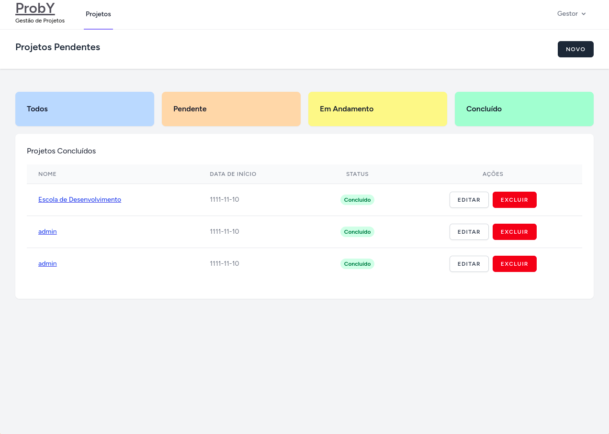
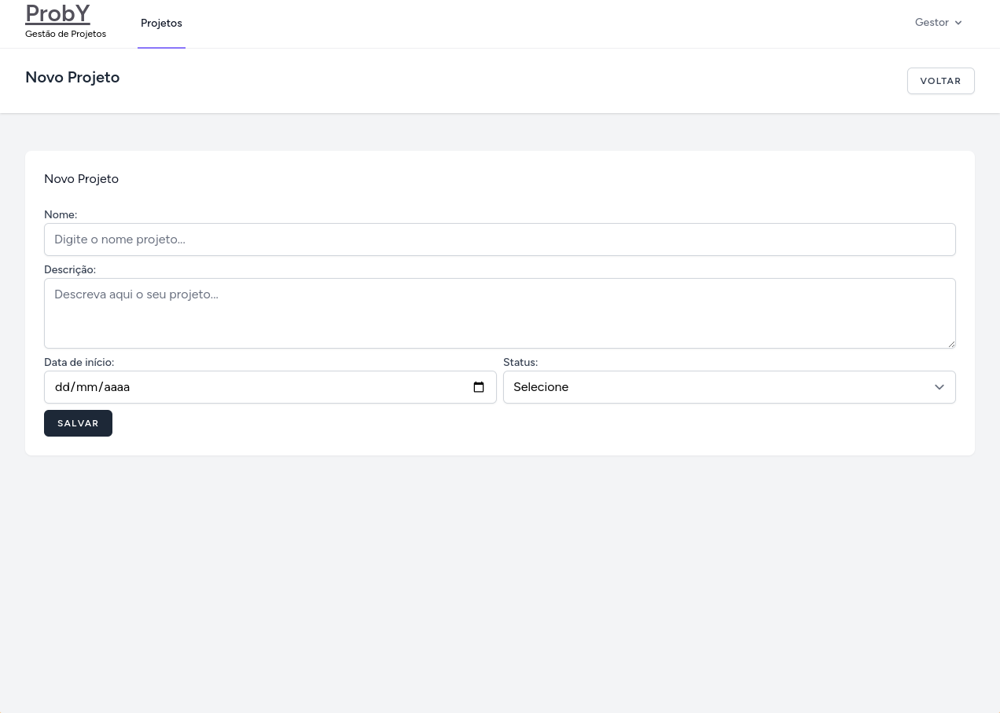
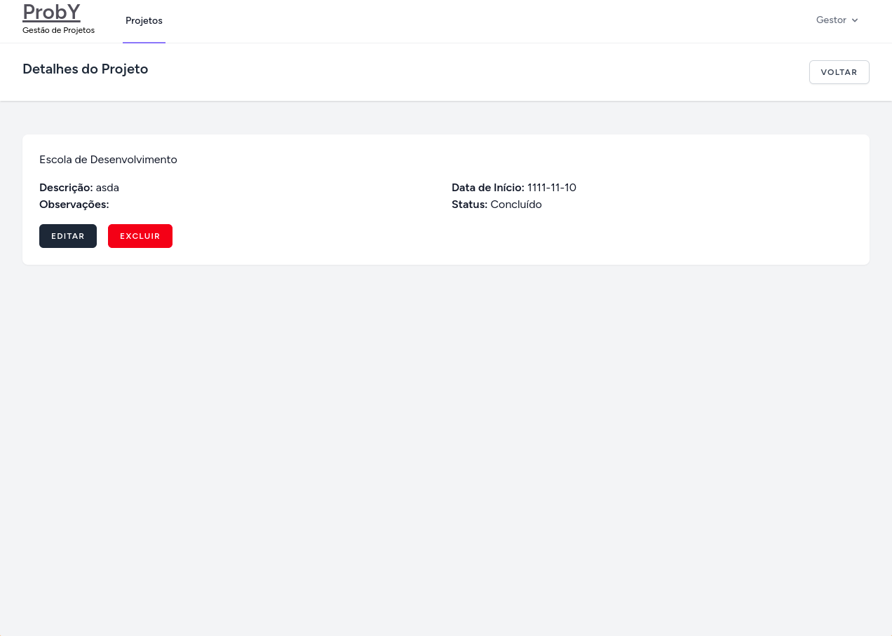
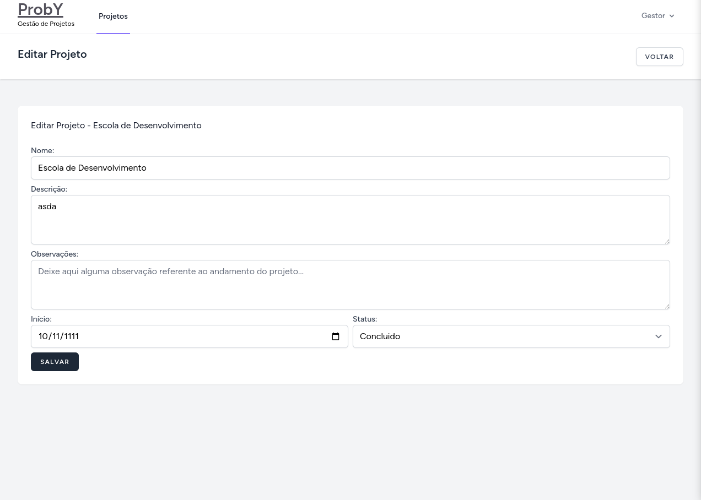

# Desafio vaga Desenvolvedor - ProbY

Autor: Régis Picáz.

Ano: 2025

# Descrição:

Este projeto é fruto do desafio para vaga de Desenvolvedor na ProbY.
Ele foi desenvolvido com o objetivo de entregar um produto, este é uma aplicação para gerenciamento de projetos internos para um empresa.
O sistema deve atender aos seguintes requisitos:

-   Cadastro, Listagem, Edição e Exclusão de projetos por usuários devidamente autenticados.

## Pré-requisitos:

-   Docker;
-   Docker compose;
-   Composer.
-  PHP8.2^.
-  Extenssões PHP: CURL, XML, DOM.
- NodeJS 20^.


## Tecnologias Utilizadas:
- Laravel 11 (Framework para PHP, utilizo a framework em 99% dos projetos que trabalho, ela me possibilita realizar entregas de produto com maior segurança do que se desenvolvesse com o PHP puro);
- Laravel Breeze (Starterkit do laravel para sistema de autenticação, auxilia na agilidade da entrega de um produto com uma dashboard "pronta" para uso);
- TailwindCSS (Pré processador de CSS, auxilia na vasta costumização de componentes sem que haja uma sólinha de CSS no código);
- PHPFlasher (Biblioteca para adição de flash messages, seu uso é impotante para que o usuário tenha um feedback visual ao adicionar, atualizar ou deletar algum projeto no sistema);

## Instalação:

1. Clone o repositório:

    ```bash
    git clone https://github.com/regispicaz/proby-teste.git
    ```

2. Acesse o diretório do projeto:

    ```bash
    cd proby-teste
    ```

3. Instalando as dependências do Composer:

    ```bash
    composer install
    ```

4. Crie um arquivo `.env` a partir do `.env.example`, observação as variáveis de ambiente já estão pré-setadas no .env.example:

    ```bash
    cp .env.example .env
    ```

5. Subindo os contêineres do Laravel e MySQL com Laravel Sail:

    ```bash
    ./vendor/bin/sail up -d
    ```

6. Gere a chave de aplicação:

    ```bash
    ./vendor/bin/sail artisan key:generate
    ```

7. Execute as migrações:

    ```bash
    ./vendor/bin/sail artisan migrate
    ```

8. Populando o banco de dados com os seeders:

    ```bash
    ./vendor/bin/sail artisan db:seed
    ```

9. Instalando dependencias do Node:

    ```bash
    ./vendor/bin/sail npm install
    ```

10. Compilando os assets:

    ```bash
    ./vendor/bin/sail npm run dev
    ```

11. Acessando o projeto:

    [http://localhost](http://localhost)

12. Dados para acesso:

    ```bash
    Login:
    admin@admin.com
    Senha:
    password
    ```

99. Encerrando os contêineres:

    ```bash
    ./vendor/bin/sail down
    ```


## Detalhes do uso da aplicação:
Página de home do Site:
Página para mostrar as opções de login, registro ou acesso ao painel caso o usuário esteja logado.


Página de Login:
Página para realização do login, também possíbilita o redirecionamento para a página de registro o necessário. 


Página de Registro:
Página para realizar o registro de usuário, nela també é possível ser redirecionado para a página de login. 


Página de projetos:
Aqui fica o painel administrativo dos projetos, nele é possível acessar os projetos clicando nos cards coloridos com nomeados com os status (Todos, Pendente, Em Andamento e Concluído).
Também é possível fazer a inserssão de um novo projeto clicando no botão "NOVO" 


Página dos projetos concluídos.
Págin lista todos os projetos que estão com o status de comcluído. 


Cadastro de projeto:
O usuário deve preencher os campos Nome, Dat de Início e Status, pois estes são obrigadtórios, caso tenha esquecido de algum destes o sistema fará a validação no backend e retrona com uma mensagem indicado que o campo é obrigatório.
Somente o campo descrição não é obrigatório o preenchimento.


Detalhes do projeto:
Nesta página é possível acompanhar os detalher do projeto e també é possível acessar a edição e fazer a deleção do projeto. 



Edição de um projeto:
Aqui é possíve realizar alteração nos dados anteriormente forecidos e também adicionar observações do andamento do projeto.

